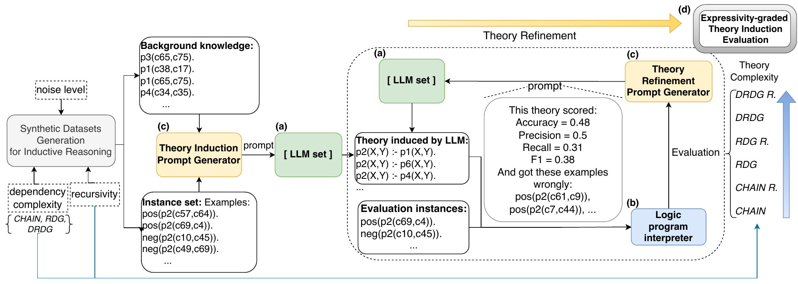

<!-- #
# SPDX-FileCopyrightText: Copyright © 2025 Idiap Research Institute <contact@idiap.ch>
#
# SPDX-FileContributor: Joao Pedro <joao.gandarela@idiap.ch>
#
# SPDX-License-Identifier: GPL-3.0-only
# -->
# ILP-LLM

Official Implementation of paper [Inductive Learning of Logical Theories with LLMs: A Expressivity-graded Analysis](https://ojs.aaai.org/index.php/AAAI/article/view/34546)

### Abstract
This work presents a novel systematic methodology to analyse the capabilities and limitations of Large Language Models (LLMs) with feedback from a formal inference engine, on logic theory induction. The analysis is complexity-graded w.r.t. rule dependency structure, allowing quantification of specific inference challenges on LLM performance. Integrating LLMs with formal methods is a promising frontier in the Natural Language Processing field, as an important avenue for improving model inference control and explainability. In particular, inductive learning over complex sets of facts and rules, poses unique challenges for current autoregressive models, as they lack explicit symbolic grounding. While they can be complemented by formal systems, the properties delivered by LLMs regarding inductive learning, are not well understood and quantified. Empirical results indicate that the largest LLMs can achieve competitive results against a SOTA Inductive Logic Programming (ILP) system baseline, but also that tracking long predicate relationship chains is a more difficult obstacle than theory complexity for LLMs. 



## 📦 Requirements

- Virtualenv or similar Python environment management tool (recommended)
- WMaxCDCL
- [NuWLS](https://ojs.aaai.org/index.php/AAAI/article/view/25505)

## 🚀 Getting Started

Follow these steps to set up and run the project:

### 1. **Clone the repository**  
   ```bash
   git clone https://github.com/JoaoPedroD/ILP-LLM.git
   cd ILP-LLM
   ```
### 2. **Run the setup script**  
   ```bash
   bash setup.sh
   ```

### 3. **installation**  
   ```bash
   python -m venv venv
   source venv/bin/activate
   pip install -r requirements.txt
   ```
   #### WMaxCDCL
   ```bash
   wget https://maxsat-evaluations.github.io/2023/mse23-solver-src/exact/WMaxCDCL.zip
   unzip WMaxCDCL.zip
   cd WMaxCDCL/code/simp
   make
   ```

   #### NuWLS-c
   ```bash
   wget https://maxsat-evaluations.github.io/2023/mse23-solver-src/anytime/NuWLS-c-2023.zip
   unzip NuWLS-c-2023.zip
   cd NuWLS-c-2023/code
   make
   cd ../bin
   ```

### 4. **Run the experiment**
```bash
python experiment_llm.py
python ilp.py
```


## 📁 Project Structure

```
.
├── data/                 # Input data files for experiments
├── experiment_llm.py     # Main experiment runner
├── ilp.py                # Main experiment runner
├── evaluation.py         # Evaluation and metrics script
├── requirements.txt      # Python dependencies
├── setup.sh              # Setup script
└── README.md             # You're here!
```

## Reference

```
@inproceedings{de2025inductive,
  title={Inductive Learning of Logical Theories with LLMs: A Expressivity-graded Analysis},
  author={de Souza, Jo{\~a}o Pedro Gandarela and Carvalho, Danilo and Freitas, Andr{\'e}},
  booktitle={Proceedings of the AAAI Conference on Artificial Intelligence},
  volume={39},
  number={22},
  pages={23752--23759},
  year={2025}
}
```